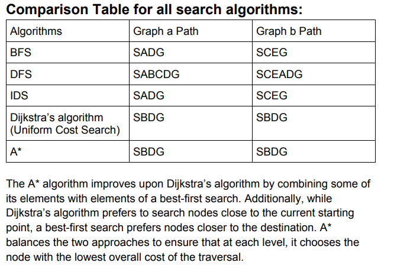

# AI-Search-Algorithms

The graph search algorithms are important in AI. This PROJECT considers the following uninformed
graph search algorithms in a given graph.

1. Breadth First Search (BFS)
2. Depth First Search (DFS) 
3. Iterative Deepening Search (IDS) 
4. Uniform Cost Search (UCS) (Dijkstra’s algorithm)
5. A* algorithm

I implemented the above algorithms to find the traversal path and exact path of any given
graph (State Space Graph).

A state-space graph can be represented as a search tree; the start state is the root node, and
children correspond to successors. There are two popular options for representing a graph: adjacency
matrix and adjacency list. You can insert the given graph using either of these options. Using an
adjacency list is easy for smaller graph representation. 

